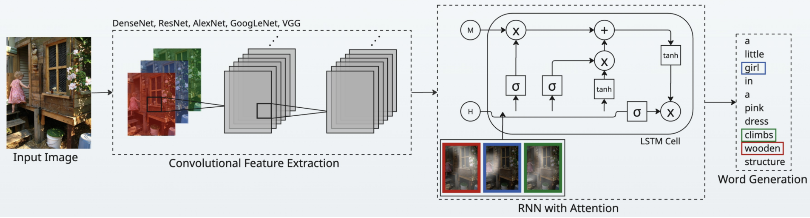
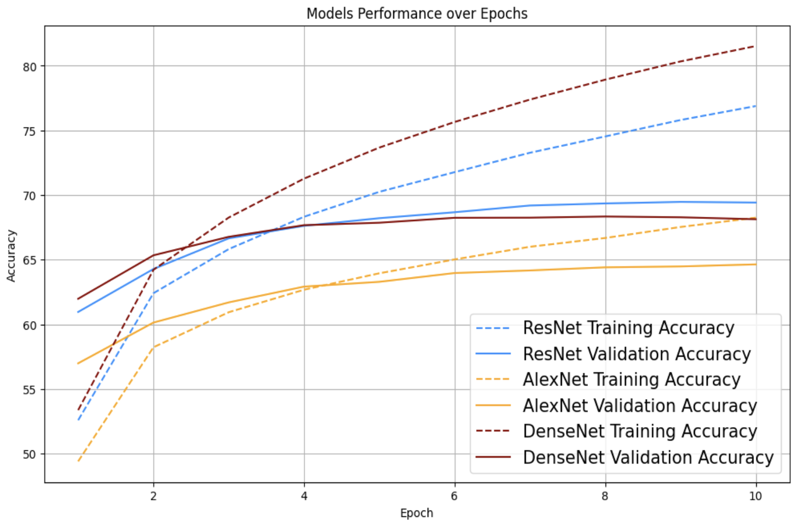
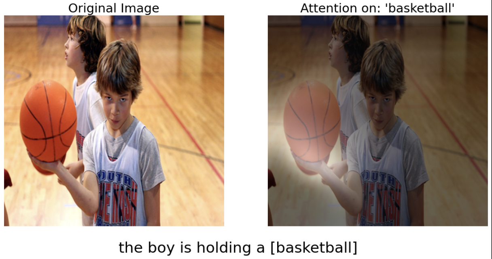
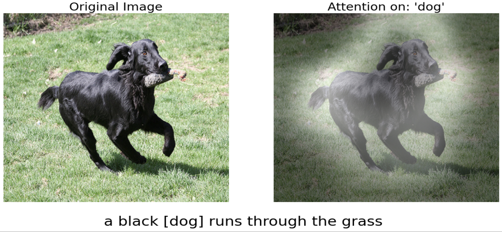
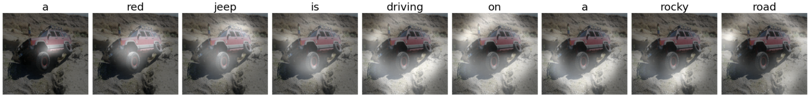

# Show, Attend and Tell: Neural Image Caption Generation with Visual Attention

## Group Members

Sunny Sun, Michael Wei, Jiye Baek, Linda Hu, Tony Chen

## Introduction

This repository re-implements the _Show, Attend and Tell_ paper by Xu et al. (2015), which introduced an attention-based mechanism for image captioning. The paper’s main contribution is the integration of soft and hard attention models into a convolutional neural network and LSTM framework, enabling the model to selectively focus on salient parts of an image while generating descriptive captions.

## Chosen Result

We aimed to reproduce the BLEU and METEOR scores reported for the soft attention model on the Flickr8k dataset, as presented in the original _Show, Attend and Tell_ paper. These metrics evaluate the quality of generated captions by comparing them to human-written references, providing a quantitative measure of a model's ability to produce fluent and relevant image descriptions.

BLEU (Bilingual Evaluation Understudy) measures n-gram precision—how many n-grams in the generated caption appear in the reference captions. BLEU-1 through BLEU-4 correspond to unigram through 4-gram precision, with higher-order scores capturing more contextual relevance but imposing stricter penalties for mismatches.

METEOR (Metric for Evaluation of Translation with Explicit ORdering), in contrast, incorporates recall alongside precision, and also accounts for stemming and synonymy. This often makes it more aligned with human judgment than BLEU, particularly when evaluating linguistic quality.

The strong BLEU and METEOR scores achieved by the soft attention model underscore the effectiveness of its architecture, particularly its visual attention mechanism. Rather than encoding the entire image into a single fixed vector, the model learns to dynamically focus on different regions of the image as it generates each word.

The attention mechanism computes a context vector as a weighted sum over annotation vectors extracted from different image regions. These weights, learned through the model, reflect the relevance of each region at a given time step. This is formalized in Equation (13) of the paper:

```math
\mathbb{E}_{p(s_t | a)}[\hat{z}_t] = \sum_{i=1}^{L} \alpha_{t,i} a_i
```

Here, $\( \alpha\_{t,i} \)$ represents the attention weight for region $i$ at time step $t$, and $a_i$ is the annotation vector for that region. This formulation allows the model to softly attend to all regions, maintaining differentiability and enabling end-to-end training via backpropagation.

To further simplify the learning process while preserving the benefits of attention, the paper introduces the Normalized Weighted Geometric Mean (NWGM). This approximates the marginal likelihood over attention locations during word generation:

```math
NWGM[p(y_t = k \mid a)] = \frac{\exp(\mathbb{E}_{p(s_t | a)}[n_{t,k}])}{\sum_j \exp(\mathbb{E}_{p(s_t | a)}[n_{t,j}])}
```

This deterministic expectation replaces sampling with a smooth approximation, reducing variance in gradient estimation and making training more stable.

Together, these mechanisms—the soft attention context computation and the NWGM formulation—enable the model to generate fluent, relevant captions that are grounded in specific parts of the image.

## GitHub Contents

This repository is organized into the following key directories:

- `code/`: Contains the re-implementation of the _Show, Attend and Tell_ soft-attention model, including training and evaluation scripts.
- `data/`: Includes the human-annotated captions for each image in the Flickr8k dataset along with instructions for obtaining the training/validation splits.
- `results/`: Stores outputs from our experiments, such as evaluation scores, attention visualizations, and generated captions.
- `poster/`: Contains the final presentation poster in PDF format.
- `report/`: Includes the final written report submitted for the course.

## Reimplementation Details


**Figure 1:** End-to-end Architecture

The overall model architecture follows the design proposed in the _Show, Attend and Tell_ paper by Xu et al. (2015). As illustrated in Figure 1, the model takes an input image and passes it through a pretrained convolutional neural network (CNN) encoder—such as VGG, ResNet, or DenseNet—to extract spatial image features. These features are then fed into a recurrent neural network (RNN) equipped with a soft attention mechanism. At each time step of the LSTM decoder, the model selectively focuses on different regions of the image to generate context vectors, which are used alongside the previous hidden state to produce the next word in the caption sequence. This attention-guided decoding continues until the model generates the complete caption.

In our re-implementation of the _Show, Attend and Tell_ paper, we focused on the soft attention mechanism using the Flickr8k dataset. Due to computational constraints, we made several modifications to the original setup. Specifically, we utilized pretrained convolutional neural network encoders (VGG16, AlexNet, DenseNet121, ResNet50, and GoogleNet) rather than training the encoders from scratch or fine-tuning them during training. This choice significantly reduced training time and resource usage, while still allowing us to extract meaningful image features.

We implemented only the soft attention variant of the attention mechanism described in the original paper, omitting the hard attention model due to its reliance on reinforcement learning, which introduces additional complexity and instability during training.

The Flickr8k dataset, being relatively small, helped us maintain fast experimentation cycles. However, this also posed a challenge in terms of model generalization, especially when compared to larger datasets like MSCOCO used in the original work. To evaluate performance, we used BLEU and METEOR scores for caption quality. The evaluation metrics of the original paper are shown in Table 1.

| Model                              | BLEU-1 | BLEU-2 | BLEU-3 | BLEU-4 | METEOR |
| ---------------------------------- | ------ | ------ | ------ | ------ | ------ |
| Google NIC (Vinyals et al., 2014)  | 63     | 41     | 27     | —      | —      |
| Log Bilinear (Kiros et al., 2014a) | 65.6   | 42.4   | 27.7   | 17.7   | 17.31  |
| Soft-Attention                     | 67     | 44.8   | 29.9   | 19.5   | 18.93  |
| Hard-Attention                     | 67     | 45.7   | 31.4   | 21.3   | 20.30  |

**Table 1**: BLEU and METEOR scores for various models on the Flickr8k dataset, as reported in _Show, Attend and Tell_.

## Reproduction Steps

1. **Prerequisites:**

   - Ensure you have Python (version 3.10 or later) installed.
   - It is recommended to use a virtual environment to manage dependencies.

2. **Install Dependencies:**

   - Install the required Python libraries using:
     ```bash
     pip install -r requirements.txt
     ```

3. **Download Flickr8k Dataset:**

   - Download the image ZIP file from [Flickr8K](https://github.com/jbrownlee/Datasets/releases/download/Flickr8k/Flickr8k_Dataset.zip) and unzip it. After unzipping, move all contents of the `Flickr8k_Dataset/` folder into the `data/` folder.

     **If you are using macOS or Linux, run:**

     ```bash
     unzip Flickr8k_Dataset.zip && mv Flickr8k_Dataset/* data/
     ```

     **If you are using Windows PowerShell, run:**

     ```powershell
     Expand-Archive -Path Flickr8k_Dataset.zip -DestinationPath .
     Move-Item -Path .\Flickr8k_Dataset\* -Destination .\data\
     ```

4. **Prepare the Data:**

   - Next, the Flickr8k images must be split into traning and validation sets. Run the following command to generate the training and validation splits:
     ```bash
     python code/data_prep.py
     ```

5. **Train the Model:**

   - Run the following command to train the model:
     ```bash
     python code/main.py
     ```
     Using a GPU is optional, but will result in faster training and inference times.

6. **Inference (Caption Generation):**

   - To view the generated captions for a given image, replace `FILENAME` with the desired image path and run the following command:

     ```bash
     python code/inference.py --image_path FILENAME
     ```

     **Example:**

     ```bash
     python code/inference.py --image_path data/667626_18933d713e.jpg
     ```

## Results and Insights

Our re-implementation of the _Show, Attend and Tell_ paper focuses on the soft attention mechanism using the Flickr8k dataset. A central contribution of this project is the evaluation of several modern, pretrained convolutional neural networks (CNNs) as encoders, in contrast to the original paper's fine-tuned CNN encoder.

| Model                           | BLEU-1    | BLEU-2    | BLEU-3    | BLEU-4    | METEOR    |
| ------------------------------- | --------- | --------- | --------- | --------- | --------- |
| Soft-Attention (Original Paper) | 67.00     | 44.80     | 29.90     | 19.50     | 18.93     |
| AlexNet                         | 60.44     | 34.90     | 19.71     | 10.81     | 12.89     |
| DenseNet                        | 64.81     | 40.82     | 26.26     | 15.84     | 16.95     |
| GoogLeNet                       | 64.53     | 40.13     | 25.12     | 14.77     | 16.45     |
| VGG                             | 64.79     | 40.37     | 25.88     | 15.48     | 17.08     |
| **ResNet**                      | **65.67** | **41.40** | **27.13** | **16.48** | **17.94** |

**Table 2:** BLEU and METEOR scores for various pretrained encoders, compared to the original soft-attention model.

Replacing the original encoder with newer architectures such as DenseNet, VGG, ResNet, and GoogLeNet led to significant performance gains over AlexNet, as reflected in both BLEU and METEOR scores. Among all the models tested, ResNet achieved the best overall performance, producing results that closely match those reported for the original soft-attention model—particularly for BLEU-1 and BLEU-3.

However, it is important to note that our implementation uses frozen, pretrained encoders, whereas the original paper fine-tuned its encoder during training. This difference likely accounts for the slightly higher BLEU and METEOR scores reported in the original work.

<br>
<strong>Figure 2:</strong> Model Performance over Epochs for ResNet, AlexNet, and DenseNet

As illustrated in Figure 2, we also observed that validation accuracy plateaued after approximately 5 epochs for all pretrained models, indicating early convergence and suggesting that fine-tuning may not be necessary when using strong pretrained feature extractors.

Finally, due to stochastic processes such as dataset shuffling during training, the exact BLEU and METEOR scores may vary slightly across runs. However, any deviations are expected to be minor, typically within ±0.25 of the reported values. When using a T4 GPU in a Google Colab environment, training typically takes between 1.5 to 2 hours with the default parameters specified in `code/config.py`.

To further illustrate how the soft attention mechanism functions in practice, we include several qualitative examples below, where attention maps are overlaid on the input images for specific words in the generated captions.

<br>
<strong>Figure 3:</strong> Attention mechanism focused on the word <em>"basketball"</em> in the input image.

In this example, the model generates the caption: "_the boy is holding a [basketball]_". When attending to the word "_basketball_", the model successfully concentrates its attention on the ball being held by the boy. The attention map demonstrates the spatial interpretability of the soft attention mechanism—it helps explain how the model grounds specific words in relevant visual regions, thereby producing a semantically meaningful caption.

<br>
<strong>Figure 4:</strong> Attention mechanism focused on the word <em>"dog"</em> in the input image.

This caption reads: "_a [dog] is running through the grass_". Here, the attention map is sharply focused on the dog’s body, indicating that the model is correctly attending to the object associated with the word "_dog_". This localized focus further reinforces the model's ability to align linguistic elements with corresponding visual cues, especially for prominent foreground subjects.

  
**Figure 5:** Attention mechanism visualization across each word in the generated caption.

In the final example, we visualize the model’s attention at every decoding step for the caption: "_a red jeep is parked on the street_". Unlike the previous two examples, this visualization highlights how attention dynamically shifts across different image regions as each word is generated. For instance, the model attends to the vehicle while generating "_jeep_", then shifts slightly to the surrounding environment when producing contextual words like "_on_" and "_street_". Interestingly, even seemingly generic words such as "_a_" display targeted attention—when preceding nouns like "_jeep_" or in other captions like "_a rocky road_", the model subtly focuses on the associated object or scene. This sequential attention flow illustrates the model’s capacity to incrementally build a coherent visual-linguistic representation, grounding each word in relevant spatial context.

## Conclusion

In this project, we re-implemented the _Show, Attend and Tell_ model with a focus on the soft attention mechanism and evaluated its performance using the Flickr8k dataset. Our key takeaways are as follows:

- We successfully replicated the improvement over AlexNet by replacing it with more modern pretrained CNN encoders such as DenseNet, VGG, GoogLeNet, and especially ResNet.
- Among all tested architectures, ResNet achieved the best overall performance, closely matching the original paper’s soft-attention results, though our BLEU and METEOR scores (Table 2) remained marginally lower due to the use of frozen encoders instead of fine-tuned ones.
- Through attention visualizations, we reproduced interpretable alignment maps that highlight which parts of the image the model attends to while generating each word, achieving similar qualitative behavior to what was reported in the original paper (Figure 1).

Overall, this re-implementation demonstrates that meaningful results can be achieved even with computationally efficient modifications, and it reinforces the value of attention-based mechanisms in image captioning models.

## References

- Kelvin Xu, Jimmy Ba, Ryan Kiros, Kyunghyun Cho, Aaron Courville, Ruslan Salakhutdinov, Rich Zemel, and Yoshua Bengio. _Show, Attend and Tell: Neural Image Caption Generation with Visual Attention._ 2015. [Paper Website](https://kelvinxu.github.io/projects/capgen.html)

- Kelvin Xu. _Arctic Captions: Theano Implementation of Show, Attend and Tell._ GitHub repository. [https://github.com/kelvinxu/arctic-captions](https://github.com/kelvinxu/arctic-captions)

- Aaron C.C. Wong. _Show, Attend and Tell: PyTorch Implementation._ GitHub repository. [https://github.com/AaronCCWong/Show-Attend-and-Tell](https://github.com/AaronCCWong/Show-Attend-and-Tell)

## Acknowledgements

This project was completed as the final project for CS 4782: Deep Learning at Cornell University. The re-implementation was independently developed and later peer-reviewed during a poster session by a teaching assistant and 16 fellow students, offering valuable feedback on the completed work.
